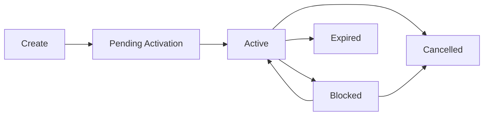

# Cards

Cards are payment instruments linked to wallets. Payment System supports both virtual and physical cards.

## Card Types

| Type | Description | Use Case |
|------|-------------|----------|
| `VIRTUAL` | Digital-only card | Online purchases, subscriptions |
| `PHYSICAL` | Tangible card shipped to user | In-store purchases, ATM withdrawals |

## Card Structure

```json
{
  "id": "crd_abc123",
  "externalId": "crd_1234567890",
  "walletId": "wal_xyz789",
  "userId": "usr_def456",
  "type": "VIRTUAL",
  "status": "ACTIVE",
  "lastFour": "4242",
  "expiryMonth": 12,
  "expiryYear": 2027,
  "brand": "VISA",
  "label": "Shopping Card",
  "spendingLimits": {
    "daily": 1000.00,
    "monthly": 10000.00,
    "perTransaction": 500.00
  },
  "createdAt": "2024-01-15T10:30:00Z"
}
```

## Card Statuses

| Status | Description |
|--------|-------------|
| `PENDING_ACTIVATION` | Card created but not yet activated |
| `ACTIVE` | Card can be used for transactions |
| `BLOCKED` | Temporarily disabled by user or system |
| `EXPIRED` | Card has passed expiry date |
| `CANCELLED` | Permanently cancelled |

## Card Lifecycle



## Spending Controls

### Per-Transaction Limits

Set maximum amount for a single transaction:

```json
{
  "perTransaction": 500.00
}
```

### Daily Limits

Maximum spending per calendar day:

```json
{
  "daily": 1000.00
}
```

### Monthly Limits

Maximum spending per calendar month:

```json
{
  "monthly": 10000.00
}
```

### Merchant Category Controls

Restrict card usage by merchant category:

```json
{
  "allowedCategories": ["5411", "5541", "5812"],
  "blockedCategories": ["7995", "6211"]
}
```

## Common Operations

### Issue a Card

```bash
curl -X POST https://api.paymentsystem.com/v1/cards \
  -H "Authorization: Bearer YOUR_TOKEN" \
  -H "Content-Type: application/json" \
  -d '{
    "walletId": "wal_abc123",
    "type": "VIRTUAL",
    "label": "Online Shopping"
  }'
```

### Activate a Card

```bash
curl -X POST https://api.paymentsystem.com/v1/cards/crd_abc123/activate \
  -H "Authorization: Bearer YOUR_TOKEN" \
  -H "Content-Type: application/json" \
  -d '{
    "activationCode": "1234"
  }'
```

### Block a Card

```bash
curl -X POST https://api.paymentsystem.com/v1/cards/crd_abc123/block \
  -H "Authorization: Bearer YOUR_TOKEN" \
  -H "Content-Type: application/json" \
  -d '{
    "reason": "Lost card"
  }'
```

### Get Card Details

For security, sensitive data (full PAN, CVV) requires additional authentication:

```bash
curl https://api.paymentsystem.com/v1/cards/crd_abc123/sensitive \
  -H "Authorization: Bearer YOUR_TOKEN" \
  -H "X-Card-PIN: ENCRYPTED_PIN"
```

<Warning>
  Sensitive card data (full card number, CVV) should only be displayed when absolutely necessary and must be handled according to PCI-DSS requirements.
</Warning>

## Virtual Card Provisioning

Virtual cards can be added to digital wallets:

- Apple Pay
- Google Pay
- Samsung Pay

```bash
curl -X POST https://api.paymentsystem.com/v1/cards/crd_abc123/provision \
  -H "Authorization: Bearer YOUR_TOKEN" \
  -H "Content-Type: application/json" \
  -d '{
    "walletType": "APPLE_PAY",
    "deviceId": "device_123"
  }'
```
