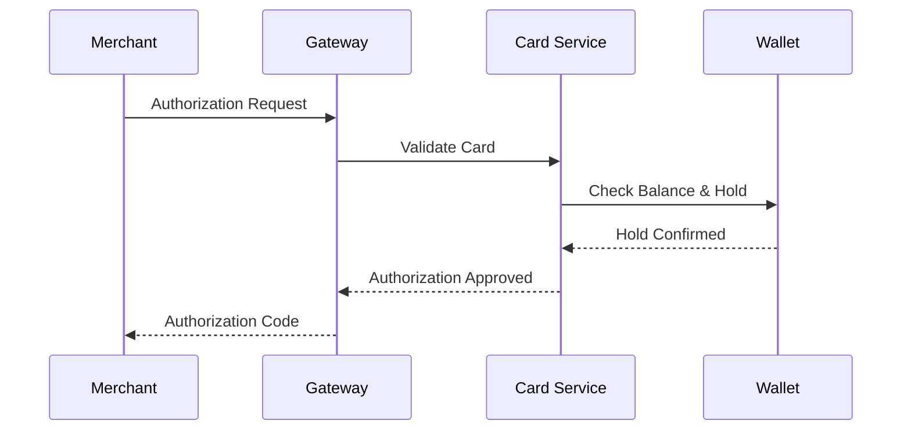

# Transactions

Transactions represent the movement of funds within the Payment System. All transactions follow a standardized flow and maintain complete audit trails.

## Transaction Types

| Type | Description |
|------|-------------|
| `AUTHORIZATION` | Hold placed on funds for a purchase |
| `CAPTURE` | Completion of an authorized transaction |
| `PURCHASE` | Direct debit without prior authorization |
| `REFUND` | Return of funds to cardholder |
| `REVERSAL` | Cancellation of an authorization |
| `P2P_TRANSFER` | Person-to-person wallet transfer |
| `TOPUP` | Funds added to wallet |
| `WITHDRAWAL` | Funds removed from wallet |

## Transaction Lifecycle

### Authorization Flow



### Transaction States

| State | Description |
|-------|-------------|
| `PENDING` | Transaction initiated, awaiting processing |
| `AUTHORIZED` | Funds held, awaiting capture |
| `CAPTURED` | Transaction completed, funds transferred |
| `SETTLED` | Funds have been settled with merchant |
| `DECLINED` | Transaction rejected |
| `REVERSED` | Authorization was reversed |
| `REFUNDED` | Funds returned to cardholder |

## Transaction Structure

```json
{
  "id": "txn_abc123",
  "externalId": "txn_1234567890",
  "type": "PURCHASE",
  "status": "CAPTURED",
  "amount": 99.99,
  "currency": "USD",
  "cardId": "crd_xyz789",
  "walletId": "wal_def456",
  "merchant": {
    "id": "mch_123",
    "name": "Example Store",
    "category": "5411",
    "city": "New York",
    "country": "US"
  },
  "authorizationCode": "AUTH123",
  "responseCode": "00",
  "createdAt": "2024-01-15T10:30:00Z",
  "settledAt": "2024-01-16T02:00:00Z"
}
```

## Authorization and Capture

### Authorize Only

Place a hold without capturing funds:

```bash
curl -X POST https://api.paymentsystem.com/v1/transactions/authorize \
  -H "Authorization: Bearer YOUR_TOKEN" \
  -H "Content-Type: application/json" \
  -d '{
    "cardId": "crd_abc123",
    "amount": 100.00,
    "currency": "USD",
    "merchantId": "mch_xyz789"
  }'
```

### Capture

Complete a previously authorized transaction:

```bash
curl -X POST https://api.paymentsystem.com/v1/transactions/txn_abc123/capture \
  -H "Authorization: Bearer YOUR_TOKEN" \
  -H "Content-Type: application/json" \
  -d '{
    "amount": 95.00
  }'
```

<Note>
  Capture amount can be less than or equal to authorization amount. Excess hold is automatically released.
</Note>

### Void Authorization

Cancel an authorization before capture:

```bash
curl -X POST https://api.paymentsystem.com/v1/transactions/txn_abc123/void \
  -H "Authorization: Bearer YOUR_TOKEN"
```

## Refunds

### Full Refund

```bash
curl -X POST https://api.paymentsystem.com/v1/transactions/txn_abc123/refund \
  -H "Authorization: Bearer YOUR_TOKEN" \
  -H "Content-Type: application/json" \
  -d '{
    "reason": "Customer request"
  }'
```

### Partial Refund

```bash
curl -X POST https://api.paymentsystem.com/v1/transactions/txn_abc123/refund \
  -H "Authorization: Bearer YOUR_TOKEN" \
  -H "Content-Type: application/json" \
  -d '{
    "amount": 25.00,
    "reason": "Partial return"
  }'
```

## Response Codes

| Code | Description |
|------|-------------|
| `00` | Approved |
| `05` | Do not honor |
| `14` | Invalid card number |
| `41` | Lost card |
| `43` | Stolen card |
| `51` | Insufficient funds |
| `54` | Expired card |
| `61` | Exceeds limit |
| `65` | Activity limit exceeded |

## Idempotency

All transaction endpoints support idempotency keys to prevent duplicate transactions:

```bash
curl -X POST https://api.paymentsystem.com/v1/transactions/authorize \
  -H "Authorization: Bearer YOUR_TOKEN" \
  -H "Idempotency-Key: unique-request-id-123" \
  -H "Content-Type: application/json" \
  -d '{...}'
```
